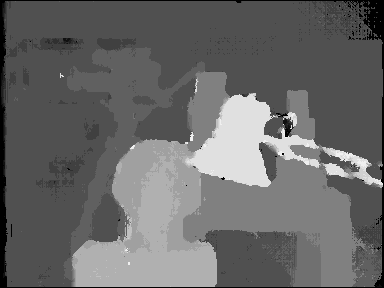

# Stereo Matching using Semi-Global Matching
A Matlab implementation of Semi-Global Matching (SGM) for stereo matching.
It uses the two-pass 8-directions version of the algorithm with a small improvement for better results.
The improvement is that in the calculation of the total cost, the matching cost does not add up (normally it had to add up eight times).

## Input Image
The Tsukuba stereo image that used as input.

   

## Output Image
The disparity map that created at the output.

   

