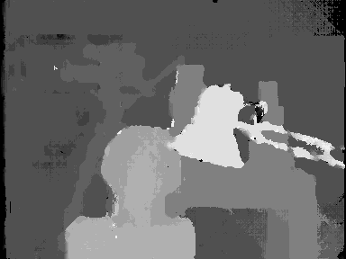
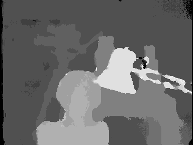

# Semi-Global Matching (SGM-4, SGM-8, SGM-16)

MATLAB implementations of the Semi-Global Matching (SGM) stereo matching algorithm, featuring 4-path, 8-path and 16-path cost aggregation variants for dense disparity map estimation.

There is also a small improvement in the algorithm for better results. The improvement is that in the calculation of the total cost, the matching cost does not add up. Normally it had to add up once for each direction (4, 8 or 16 times).

## Input Image
The Tsukuba stereo image that used as input.

 

## Output Image
The disparity maps that created at the output.

### SGM-4

### SGM-8

### SGM-16

